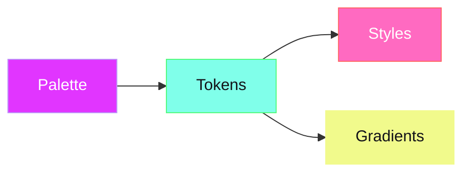

# Introduction

Opaline is a **token-based theme engine** for [Ratatui](https://ratatui.rs) TUI applications. It gives your terminal app a complete theming system — from raw hex colors to semantic tokens to composed styles — all driven by TOML configuration.

## Why Opaline?

Most Ratatui apps hardcode colors directly in their render functions. This works fine for small projects, but as your app grows you end up with magic color values scattered everywhere:

```rust
// The usual approach — colors everywhere
let style = Style::default().fg(Color::Rgb(225, 53, 255)).bold();
let border = Style::default().fg(Color::Rgb(128, 255, 234));
```

Opaline replaces this with **semantic names** that resolve through a theme:

```rust
use opaline::{Theme, ThemeRatatuiExt};

let theme = Theme::default();

// Semantic — the theme decides what "keyword" looks like
let style = theme.ratatui_style("keyword");
let border = theme.ratatui_style("focused_border");
```

Change the theme, and every styled element updates automatically. Users can switch between 20 builtin themes or load custom ones from TOML files.

## Architecture

Opaline uses a three-layer resolution pipeline:



1. **Palette** — Named hex colors (`purple = "#e135ff"`)
2. **Tokens** — Semantic references to palette (`accent.primary = "purple"`)
3. **Styles** — Composed fg/bg + modifiers (`keyword = { fg = "accent.primary", bold = true }`)

This separation means palette swaps propagate through the entire theme automatically. Change one hex value and every token referencing it updates.

## Features at a Glance

| Feature | Description |
|---------|-------------|
| **20 builtin themes** | SilkCircuit (5 variants), Catppuccin, Dracula, Nord, Tokyo Night, Rose Pine, Kanagawa, Gruvbox, One Dark, Solarized, Everforest |
| **Token system** | 40+ semantic tokens across 10 namespaces |
| **Gradients** | Multi-stop color interpolation with `at(t)` and `generate(n)` |
| **Ratatui adapter** | `From` impls, `ThemeRatatuiExt` trait, gradient spans/lines/bars |
| **CLI adapter** | `colored` crate integration for non-TUI terminal output |
| **ThemeBuilder** | Programmatic theme construction without TOML |
| **Strict resolver** | Cycle detection, unresolvable reference errors |
| **Zero unsafe** | `unsafe_code = "forbid"` — no exceptions |

## Next Steps

- [Installation](./installation) — Add Opaline to your `Cargo.toml`
- [Quick Start](./quick-start) — Load a theme and render styled content in 5 minutes
