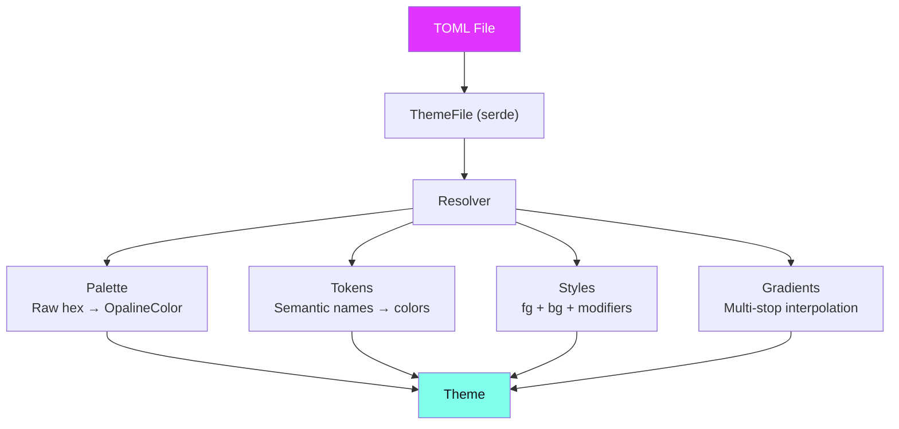

# Theme System

Opaline's theme system is built around a **three-layer resolution pipeline** that transforms raw hex colors into fully composed styles.

## The Resolution Pipeline



### Layer 1: Palette

Raw named colors. These are the building blocks — hex values with human-readable names:

```toml
[palette]
purple = "#e135ff"
cyan = "#80ffea"
coral = "#ff6ac1"
bg_dark = "#121218"
```

### Layer 2: Tokens

Semantic references that point to palette colors. This is where meaning lives:

```toml
[tokens]
"accent.primary" = "purple"      # resolves to #e135ff
"accent.secondary" = "cyan"      # resolves to #80ffea
"bg.base" = "bg_dark"            # resolves to #121218
```

Tokens can reference other tokens — the resolver handles transitive lookups with cycle detection.

### Layer 3: Styles

Composed styles that combine a foreground color, background color, and text modifiers:

```toml
[styles]
keyword = { fg = "accent.primary", bold = true }
selected = { fg = "accent.secondary", bg = "bg.highlight" }
error_style = { fg = "error" }
```

Style `fg` and `bg` values reference tokens, which reference palette colors. Change the palette and everything downstream updates.

## Theme Structure

A complete Opaline theme TOML file has four sections:

```toml
[meta]
name = "My Theme"
author = "me"
variant = "dark"        # "dark" or "light"
version = "1.0"
description = "A beautiful theme"

[palette]
# Raw hex colors...

[tokens]
# Semantic token mappings...

[styles]
# Composed style definitions...

[gradients]
# Named gradient stop lists...
```

## Loading Themes

```rust
use opaline::Theme;

// From a TOML string
let theme = opaline::load_from_str(toml_string)?;

// From a file path
let theme = opaline::load_from_file("path/to/theme.toml")?;

// From builtins
let theme = opaline::load_by_name("dracula").unwrap();

// Default (SilkCircuit Neon)
let theme = Theme::default();
```

## Strict Resolution

The resolver is intentionally strict. If a token references a palette color that doesn't exist, or a style references an undefined token, you get a clear error — not a silent fallback.

```rust
// This will error if "nonexistent" isn't in the palette
// "accent.primary" = "nonexistent"
// → OpalineError::UnresolvableToken { name: "accent.primary", reference: "nonexistent" }
```

Circular references are also detected:

```rust
// "a" = "b", "b" = "a"
// → OpalineError::CircularReference { chain: ["a", "b", "a"] }
```

## Variant Helpers

Every theme declares whether it's dark or light:

```rust
let theme = Theme::default();
assert!(theme.is_dark());

let latte = opaline::load_by_name("catppuccin-latte").unwrap();
assert!(latte.is_light());
```

This is useful for adapting UI elements that need variant-aware rendering (like borders or shadows).
